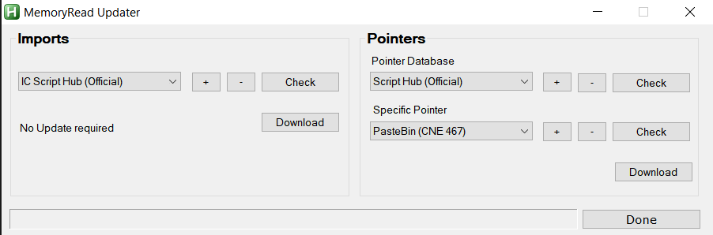

# IC_MemoryUpdater

  - [Description:](#description)
  - [Imports:](#imports)
  - [Pointers:](#pointers)
    - [Pointer Database:](#pointer-database)
    - [Specific Pointer:](#specific-pointer)
  - [More Information:](#more-information)
  
## Description:
This AddOn is meant to help users share updated memory read files more easily.
The addon will add a button to the About tab that launch a utility for updating pointers and offsets (Imports).
  
## Imports:  
> Currently only supports Github repositories.

>&#x26a0;&#xfe0f;Warning:  Imports are AHK scripts and contain code that can be executed on your computer. Be sure you trust the location you are downloading imports from before downloading them into IC Script Hub.

 How to use:
 1. Select a location from the drop down list. 
 2. Click "Check" to see if the location contains updates.
 3. Click "Download" to replace IC Script Hub's Imports.  

 - Use "+" to add a new Github repository URL to the list and give it a name.  
 - Use "-" to delete the currently selected item in the list.  

Even if no update is required, you can still click "Download" to retrieve remote imports. This allows for backwards compatibility in retrieving imports for older versions.

## Pointers:  

 How to use:
 1. Select a location from the drop down list. 
 2. Click "Check" to see if the location contains changes.
 3. Click "Download" to replace IC Script Hub's current pointers or its pointer database (depending on which was last checked).  

 - Use "+" to add a new Github repository URL to the list and give it a name.  
 - Use "-" to delete the currently selected item in the list.  

### Pointer Database:  
> Currently works for any URL that allows download of the raw text file. Github and Pastebin have additional functionality that allow the raw file to be determined automatically.

This file contains the potential pointer options that can be selected using the Version Picker.

### Specific Pointer:  
> Currently works for any URL that allows download of the raw text file. Github and Pastebin have additional functionality that allow the raw file to be determined automatically.

Updating this will effectively perform the same action as selecting an option from the Version Picker, but allows the user to do so from a remote URL. This allows users to share their current working pointer file with each other.

## More Information:
[Imports and Pointers Help - FAQ](docfiles/imports-pointers-help.md#imports-and-pointers-help---faq)
